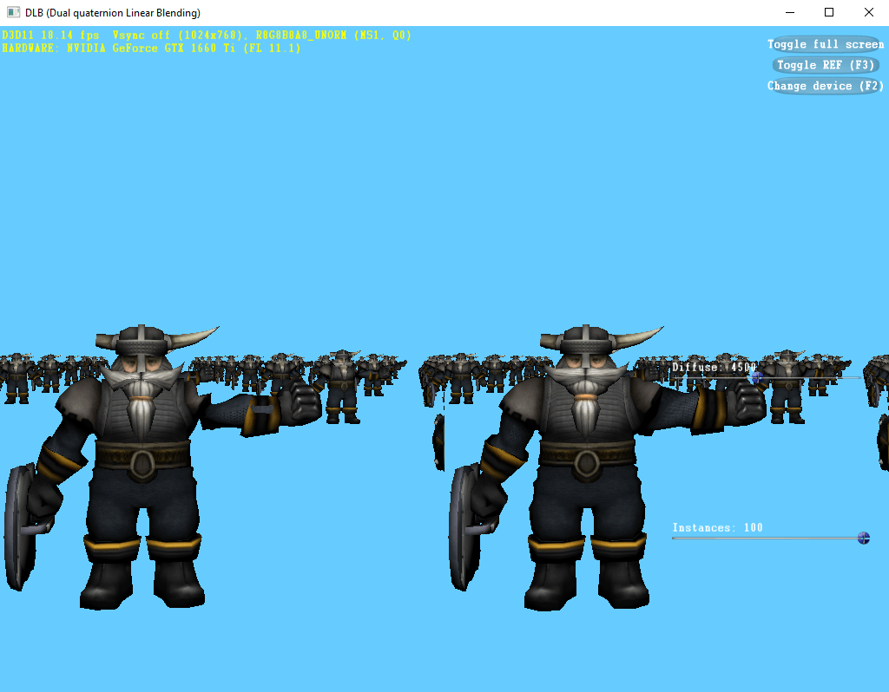

##  DLB (Dual Quaternion Linear Blending)  

  

- [x] DLB.h: the c++ code of mapping the rigid transformation to the unit dual quaternion  
- [x] DLB.hlsli: the hlsl code of DLB (Dual quaternion Linear Blending) and mapping the unit dual quaternion to the rigid transformation  
- [x] DLB.glsli: the glsl code of DLB (Dual quaternion Linear Blending) and mapping the unit dual quaternion to the rigid transformation  

  
